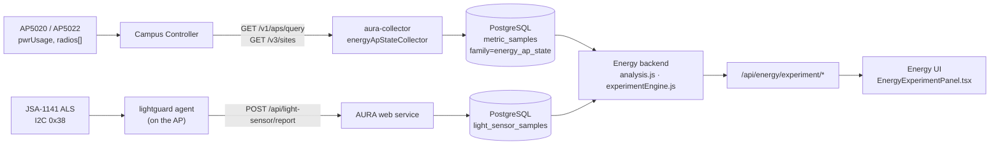
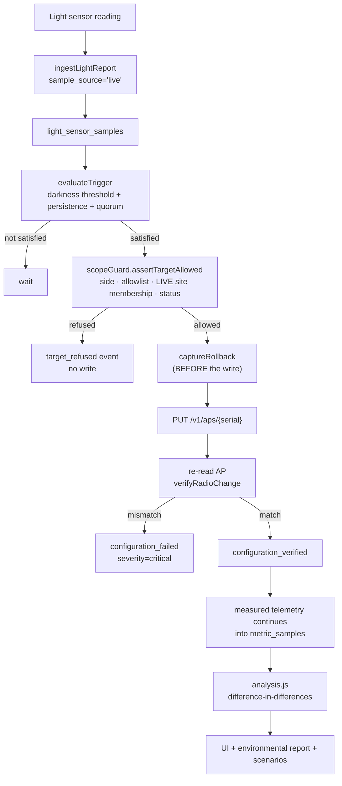
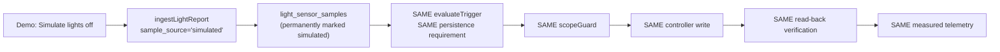

# Energy site-vs-site experiment (POC)

A controlled A/B experiment that measures what an AP energy action actually
saves, against a concurrent control site, using real controller telemetry.

**Any site can be compared against any other site.** One is the ENERGY OPTIMIZED
site — the energy action is applied there, and it is the `treatment` side in the
schema and the API — and the other is the CONTROL, deliberately left alone so
that whatever moves both sites can be subtracted out. The pair is configuration,
chosen in the POC control panel; nothing about it is baked into the schema.

**For the EAL demonstration the pair is `EAL-PT-N` (energy optimized) and
`EAL-PT-S` (control).** Those two names are proposed by default, resolved to
live site ids on every discovery pass, and `ENERGY_DEMO_PAIR` overrides them
without a code change — see §2.1. The UI labels the two sides *Energy optimized
site* and *Control site* explicitly; nobody should have to infer the roles from a
site name ending in `-N` or `-S`.

The Energy page already modelled savings. This measures them — and the first
measurement disagreed with the model by 57% relative, which is the reason the
feature exists.

---

## 1. What was established on hardware

Everything below was measured on the lab controller (XCC `10.20.1.0-020R`) and
on live AP5020 / AP4020X units. None of it is assumed.

| Question | Answer | How it was established |
|---|---|---|
| Is there a real per-AP wattmeter? | Yes — `pwrUsage` on `GET /v1/aps/query`, in watts | Read live; moves within ~30 s of a radio change |
| Can Tx power be set? | **No.** `PUT /v1/aps/{serial}` returns **200** and `radios[].txPower` is unchanged | Requested 5 dBm twice; read back 12 dBm both times |
| Can a radio be disabled? | Yes — `radios[].adminState=false` + `adminStateOvr=true` | Verified by read-back; `txPower` then reports 0 |
| Does disabling a radio actually save power? | Yes — AP5020 6 GHz off: **14.112 W → 11.868 W (−15.9%)** | Control AP `-C0044` stayed 14.30–14.47 W over the same 2 minutes |
| Does the AP5020 have an ambient-light sensor? | Yes — **JSA-1141 at I2C `0x38`**, same register map as the AP4020X | Read on three AP5020s: 7, 15, 50 raw counts in differently lit rooms |
| Is the sensor value lux? | **No.** It is an uncalibrated 16-bit count | Dark radome ≈ 2, lit lab 6–52. Thresholds are expressed in raw counts |
| Is the action safe on every model? | **No.** AP5020 and AP5022 only | See §6.1 — the AP4020X did not survive it |

**`powerModel.js` assigns the 6 GHz band `BAND_SHARE = 0.25`. The measurement
came out at 0.159.** The model is not wrong to exist — it lets the What-if tool
answer questions with no experiment behind them — but it is a model, and this
POC is what lets a measured number be quoted instead.

---

## 2. Architecture

### 2.1 The EAL pair, and how it is chosen

Three tiers, highest first:

1. **Configured** — `energy_experiment_config.treatment_site_id` /
   `control_site_id`, set from the POC control panel. Always wins. A configured
   id that no longer resolves stays unresolved and raises an anomaly; it never
   silently falls back, because that would re-point the energy action at
   different hardware.
2. **The named demo pair** — `EAL-PT-N` (optimized) against `EAL-PT-S`
   (control), matched by site NAME and resolved to live ids each pass. Reported
   as `pair.reason = 'demo_pair'`. By name rather than id on purpose: an id
   changes when a site is rebuilt and a stale one proposes nothing, whereas the
   names are what the lab, the runbook and the APs are labelled with.
3. **The `-N`/`-S`/north/south heuristic**, for any other controller. Proposes
   nothing when the match is ambiguous.

**The optimized site must have at least one AP assigned to it.** This is not a
formality and it is the one thing to check before a demonstration:

- the real path cannot apply an energy action to an empty site;
- the **fail-safe cannot rescue it either**, because the projection is built from
  the optimized site's own measured power history, and an empty site has none.

APs are conventionally named for their site, so discovery looks for that case
specifically and names the fix. Found in the lab exactly this way:

> Treatment site 'EAL-PT-N' has no access points assigned. WF062632W-50092
> ('EAL-PT-N-5th-Floor', AP5022) is named for this site but is currently in
> 'EAL'. Assign it to 'EAL-PT-N' on the controller to run the experiment on real
> hardware.

`EAL-PT-N-5th-Floor` and `EAL-PT-S-5th-Floor` are both AP5022s drawing within
1.7% of each other (14.846 W vs 14.596 W measured 2026-09-14), which makes them
an unusually good pair — `assessComparability` rates them `comparable`. The only
thing missing is the site assignment.

### Data flow



The browser is never the collector. If nobody opens AURA for three days, the
collector still writes a sample per AP per minute, and the history is there when
someone does.

### Control flow



### Demo override takes the same path



The fallback simulates the **trigger**, not the result. It does not touch the
power telemetry, does not write a saving, and cannot make the chart diverge on
its own — the divergence still has to come from a real radio being switched off.

---

## 3. Database

Migration `0018_energy_experiment.sql`.

| Table | Holds |
|---|---|
| `energy_experiment_config` | The treatment/control pair, sensor thresholds, the action. One row per source |
| `energy_experiments` | One row per run: state, windows, trigger source, frozen metrics |
| `energy_experiment_devices` | The allowlist, snapshotted at enrollment, per side |
| `energy_experiment_rollback` | Captured pre-change config, apply/restore verification |
| `energy_experiment_events` | The human-readable timeline, with provenance |

Also: `light_sensor_samples.sample_source` (`live` \| `simulated`).

**Telemetry is not duplicated.** Per-AP power and radio state go into the
existing `metric_samples` under `metric_family = 'energy_ap_state'`, so they
inherit the identity index (idempotent re-ingest), `expires_at` retention, site
scoping, and the existing aggregation paths.

| Metric name | Unit | Provenance |
|---|---|---|
| `ap.power_watts` | W | measured (`pwrUsage`) |
| `ap.client_count` | clients | measured |
| `radio.tx_power` | dBm | measured |
| `radio.admin_enabled` | 0/1 | **derived** (tx power > 0), tagged `source: 'derived'` |
| `radio.clients` | clients | measured |
| `radio.channel_occupancy` | % | measured |

Provenance lives in the `dimensions` jsonb rather than `quality_state`, so the
CHECK constraint shared with every other metric family did not have to be
widened for this feature.

`uniq_energy_experiment_active` is a partial unique index: at most one
experiment per controller may be in flight. Two concurrent runs would hand two
engines the same rollback state and the same APs.

### Retention

`MONITORING_RETENTION_DAYS = 30` on Integration, and `expires_at` is stamped per
row at write time — so changing the setting never retroactively destroys
history. 30 days comfortably covers the 7-day comparison. `light_sensor_samples`
has no `expires_at` and is not swept: it is one small row per AP per report, and
the sensor evidence for a past experiment should outlive the telemetry window.

The experiment, allowlist, rollback and event tables are **never** touched by
the retention sweep (`server/monitoring/retention.js` deletes only from
`metric_samples`, `collection_runs`, and orphaned `current_metric_state`).

---

## 4. Collector

`server/monitoring/collectors/energyApStateCollector.js`, driven by its own loop
in `server/monitoring/energyApStateRunner.js`.

**It deliberately does not ride the main collection tick.** `startCollector`
skips a tick while the previous one is still running, and the per-AP report
collector routinely outlasts the poll interval — measured on Integration with 8
APs and a 60 s setting, energy samples actually landed every 180–240 s. A
four-minute treatment window then contained one sample per AP, one LEAD gap of
zero, and therefore no measurable result at all. The dedicated loop is
advisory-locked per source exactly like the main runner, so replicas cannot
double-ingest.

- Two controller calls per tick (`/v1/aps/query`, `/v3/sites`) for the **whole
  fleet**, regardless of fleet size.
- On by default (`ENERGY_AP_STATE_ENABLED`, default `true`).
- Runs at `MONITORING_POLL_INTERVAL_SECONDS` (60 s on Integration).
- An offline AP, or one reporting no `pwrUsage`, gets **no power sample** — a
  gap, never a zero. A zero would integrate as real time spent consuming
  nothing.
- The timestamp is marked `collection_timestamped`: `/v1/aps/query` carries no
  per-field time, and claiming the source supplied one would be false.

---

## 5. Baseline methodology

1. `selectBaselineWindow` picks the longest window **both** sides can support —
   7 d, then 3 d, then 24 h. The weaker side governs: a 7-day the treatment site and a 2-hour
   the control site is a 2-hour comparison.
2. Below 24 h it returns `partial` and the UI says
   *"Historical baseline limited: N hours available."* It never promotes short
   history to a longer label.
3. With a day or more available, `matchedTimeWindows` compares the **same clock
   hours** on each preceding day. Wireless draw is diurnal; an 8 pm treatment
   measured against a 24-hour mean would be credited with the evening lull.
4. **Every previous treatment period is cut out of the baseline window**
   (`subtractWindows`). Without this, two experiments an hour apart make the
   second one's baseline the first one's *result*. Observed live: a the treatment site
   baseline of 12.658 W/AP against a true normal of ~13.7 turned a real ~10%
   reduction into a reported 1.3%. The baseline payload reports
   `excludedTreatmentSeconds` and `cleanBaselineSeconds` so a short baseline
   explains itself.
5. Per-AP rows are merged across surviving windows weighted by observed seconds,
   so an AP that reported for two minutes cannot move the mean like one that
   reported for two hours.

### Normalization

Everything is reported **per AP**. the treatment site and the control site rarely have the same AP
count — in the lab it is 4 vs 2 — and a raw site total would make the smaller
site look more efficient for a reason unrelated to the energy action. Site
totals are still available; they are just never the comparison.

### Attribution

Three numbers, deliberately kept separate:

| Figure | Meaning | Weakness |
|---|---|---|
| `withinTreatment` | The treatment site during treatment vs its own matched baseline | Confounded by anything that moved both sites |
| `crossSite` | treatment vs control during treatment | Assumes the two sites were comparable to begin with |
| `attributed` | **Difference-in-differences**: the treatment site's change relative to the control site's change over the same clock time | The headline figure |

`attributed = (treatmentBaseline × controlDrift) − treatmentCurrent`, where
`controlDrift = controlCurrent / controlBaseline`. If the evening quietens both
sites by 10%, that 10% is removed from the claim.

`assessComparability` reports how close the two sites were **before** the
treatment as a ratio and a plain verdict (`comparable` ≤ 5%, `similar` ≤ 15%,
else `divergent`). There is no p-value, because with six APs and one experiment
there is no honest significance test to run and a fake one would be worse than
none.

**No claim is made at all** when `assessQuality` rates the window
`insufficient` — a side reporting nothing, or a window shorter than three
sample intervals. The UI then says "Collecting", not "0%".

---

## 6. The energy action

`{"kind": "disableRadios", "radioIndexes": [3], "requireZeroClients": true}`

Radio 3 is the 6 GHz radio on every AP5020/AP5022 in the lab and it carries zero
clients. Chosen because it:

1. produces a measurable saving (−15.9% on an AP5020),
2. is reversible in one write,
3. is verifiable by read-back **and** by the power telemetry,
4. never touches the management path (eth0),
5. with `requireZeroClients`, cannot drop a user's session.

### 6.1 Model allow-list — why it exists

`apCapabilities.supportsVerifiedRadioDisable()` is an **allow-list**
(`AP5020`, `AP5022`), not a deny-list. An untested model is refused.

It exists because of what an **AP4020X** did during the first live run:

1. It accepted `adminState=false` + `adminStateOvr=true`, persisted it, and
   returned it on read-back — while the same object reported `txPower: 17` on
   that radio, still on 5955 MHz, with its power draw unchanged. The three
   AP5020s in the same site went to 0 dBm and dropped 2.2 W each.
2. Minutes later it went `status: critical`, `pwrUsage: 0.0`, and left the
   network. SSH to it timed out.
3. Restoring the configuration **was verified by read-back** and did **not**
   bring the AP back into service.

Three mitigations came out of it, all in code:

- `checkRadiosOffAir()` — the device's own transmit-power report is required as
  second evidence, so "config landed" can never be reported as "radio off".
- The model allow-list — an unverified model is refused at the scope guard, with
  reason `model_not_verified_for_action`.
- `ap_unhealthy_after_restore` — a `critical` event when an AP's configuration is
  confirmed restored but the AP is not back in service.

This is a device/firmware issue worth raising with PLM. Do not re-add the
AP4020X to the allow-list without a firmware fix and a repeated test.

`scopeGuard.assertActionPermitted` rejects anything else — specifically
`reduceTxPower`, because this controller accepts that write with a 200 and does
nothing, so permitting it would let the engine report an action it did not
perform.

---

## 7. Safety boundary

`server/energy/experiment/scopeGuard.js` — pure, no I/O, 14 tests. Every
configuration-changing operation passes through it.

A write is permitted only when **all** of these hold:

1. an experiment exists and belongs to the calling controller;
2. the experiment is in a state where a change is legitimate (restore is allowed
   from every state, including `error`);
3. the AP is in that experiment's device allowlist;
4. the AP is on the **treatment** side — the control is never modified;
5. the AP is present in the **live** controller inventory, read at write time;
6. the AP's live `hostSite` still matches both its enrollment record and the
   experiment's the treatment site site name;
7. the AP is `InService`, so the write can be verified.

A UI-supplied site name is never evidence. Refusals are recorded as
`target_refused` events with a named reason, so a treatment group that shrank is
visible rather than silent.

---

## 8. Write verification

`radioActuator.js`:

```
read AP  →  capture rollback (persisted BEFORE the write)  →  PUT
         →  settle 5 s  →  re-read AP  →  compare against intent
```

- A 200 is not evidence. This controller demonstrably returns 200 for a field it
  ignores.
- The read-back also rejects a body that is not shaped like an AP: an unmatched
  `/api/*` path is proxied to the controller, which answers with a Jetty HTML
  page.
- Capture strictly precedes the write, so a crash in between leaves a restorable
  record rather than an unknown AP.
- `captureRollback` never overwrites an existing `original` — a second apply in
  one experiment must still roll back to the pre-experiment state.

## 9. Rollback

`restoreTreatment` walks every AP with `applied_at IS NOT NULL AND restore_verified
= false`, re-checks the scope guard, restores, and **verifies by read-back**.

- Anything unverified raises a `critical` event and the experiment goes to
  `error`, not `complete`.
- The API answers **207**, not 200, for a partial restore — a true and important
  result, not a server error.
- `POST /restore-all` sweeps every unrestored AP across every experiment on the
  controller, regardless of experiment state. This is the button for "I do not
  know what state the lab is in."
- Readiness **fails** while any AP is unrestored, so the next experiment cannot
  start on top of the last one.
- Restore is also the **cancel** path. An experiment abandoned during baseline
  collection has nothing to roll back, and restoring it closes the run as
  `complete` — otherwise it would stay in flight forever and the partial unique
  index would block every subsequent experiment.

---

## 10. Provenance

| Class | Meaning | Where it appears |
|---|---|---|
| `measured` | Controller-reported value | `ap.power_watts`, all radio series |
| `derived` | Computed from a measured value | `radio.admin_enabled` |
| `calculated` | Model output | Baseline windows, projections |
| `simulated` | Synthetic | Demo-override sensor samples only |

Savings carry one of three provenances:

- **`measured`** — real trigger, real controller write, real telemetry.
- **`measured-telemetry-simulated-trigger`** — the trigger was the demo
  override; the controller action and every power reading are real.
- **`simulated`** — no controller write was applied. The UI frames the whole
  headline in warning colour and the environmental report **excludes it
  entirely**.

Simulated sensor samples are marked in the database forever. The demo override
switch itself is in-process only and dies with the service: a forgotten override
is the one way this feature could quietly poison real history.

---

## 11. Scenario and environmental-report integration

No second engine was built.

- `scenarioEngine.extrapolateObserved()` scales the **measured** per-AP watt
  saving to any AP count × hours/day, via `GET /api/energy/experiment/scenario`.
  It starts from the observed figure rather than `BAND_SHARE`. Every projection
  is `null` when the observed saving is missing or non-positive.
- `environmentalReport.buildControlledExperimentEvidence()` adds the experiment
  as an opportunity with `evidenceStatus: 'measured'` — the only opportunity in
  the report that is not modelled — plus a `controlledExperiment` block naming
  the treatment site, control site, attribution method and comparability
  verdict. A run whose controller writes did not land, or whose data quality
  cannot support a claim, is **excluded**, not downgraded.
- The existing ISO 14001 disclaimer is unchanged: AURA supports an
  environmental management system; it does not certify one.

---

## 12. The light sensor

`scripts/lightguard.sh` — a POSIX-sh agent that runs on the AP's BusyBox
userland.

```
i2cset 0x04 ← 0x82   gain
i2cset 0x05 ← 0xff   integration time
i2cset 0x00 ← 0x01   trigger a conversion
i2cget 0x1e, 0x1f    data low, data high
```

Gotchas that cost time and are now handled:

- **The first conversion after configuration reads 0x00 on every AP tested.**
  The agent primes with a throwaway read and never reports it. Without this, a
  freshly started agent reports a false "dark".
- A failed I2C read sends **no report at all**. A missing reading must not look
  like darkness.
- The agent lives in `/tmp`, so an AP reboot is a clean uninstall. Re-run
  `deploy-lightguard.sh` after a reboot.
- APs rate-limit repeated SSH logins; the deploy script paces itself.

`deploy-lightguard.sh` verifies rather than assumes: it probes for the sensor
before installing, and then polls AURA's own `/api/light-sensor/states` until
each AP's readings actually arrive.

### Debounce

`lightSignal.js`, against the experiment's configured thresholds:

- `darkness_threshold_raw` / `darkness_persistence_seconds`
- `recovery_threshold_raw` / `recovery_persistence_seconds`
  (the CHECK constraint forces recovery ≥ darkness, which is the hysteresis that
  prevents oscillation near the threshold)

- A **single** reading above the threshold resets the dark run, so a camera
  flash or an opened door cannot satisfy persistence.
- At least two samples are required — one report can never switch a radio off.
- A stale feed (>180 s) cannot trigger, in either direction.
- `unknown` is never read as dark.
- Fleet quorum is computed over **reporting** sensors only. Silent sensors are
  excluded from the denominator and counted separately, and **zero reporting
  sensors never triggers**: a dead feed is not a dark room.

---

## 13. Known limitations

1. **`EAL-PT-N` currently has no access points on the lab controller.** The
   configured pair is `EAL-PT-N` (treatment) / `EAL-PT-S` (control); readiness
   fails on the treatment side and says so until APs are assigned to it. No code
   change is needed — the pair is configuration, and readiness flips to READY on
   the next poll once membership exists.
2. **Unequal group sizes and mixed AP models are tolerated, not ideal.**
   Discovery raises an anomaly for both, and every comparison is normalized per
   AP, but a matched pair is a stronger experiment. `EAL-PT-S` currently holds a
   single AP5022.
3. **`radio.admin_enabled` is derived**, not read. `/v1/aps/query` does not carry
   `adminState`; `/v1/aps/{serial}` does, and that is what the write path
   verifies against. The collector series is a convenience for the UI.
4. **The AP4020X is excluded from the treatment group** by the model allow-list
   (§6.1) until its firmware behaviour is fixed. On this lab controller that
   reduces a 4-AP the treatment site group to 3.
5. **The controller intermittently returns HTTP 500** on
   `/management/v1/aps/query`. Observed once in the first hour. The collector
   records a failed run and writes nothing, so the result is a one-minute gap
   rather than bad data.
6. **No statistical significance test.** With this fleet size there is no honest
   one. Comparability is reported as a ratio and a verdict.
7. **Tx power reduction is not available** as an action on this controller
   version, so the only verified lever is radio enable/disable.
8. **One experiment at a time per controller**, enforced by a partial unique
   index.

---

## 14. Running the live POC

**Prerequisites** — `POC READY` with no `fail` rows at
`GET /api/energy/experiment/readiness`.

1. Open **Energy** in AURA. The treatment-vs-control card is at the top.
2. **Show POC controls**.
3. Confirm or set the site pair, then **Save pair**. (Pair changes are refused
   while an experiment is in flight.)
4. **Start experiment.** State → `collecting_baseline`.
5. Let the baseline run. It is usable immediately, but the longer it runs the
   stronger the label: hours → `partial`, 24 h → `24h`, 3 d → `3d`, 7 d → `7d`.
6. **Establish baseline.** State → `baseline_established`. Metrics are frozen
   onto the experiment row.
7. **Turn the lights off at the the treatment site site.**
8. Watch the control panel's trigger line: `dark N/M reporting · raw …`. After
   `darkness_persistence_seconds` of sustained dark readings across a quorum,
   the engine fires on its own.
9. The timeline records: darkness confirmed → per-AP `configuration_verified` →
   `optimization_activated`.
10. The chart diverges: the treatment site steps down, the control site does not. Savings accumulate.
11. Switch **Live / 24H / 3D / 7D / POC**; drill into **Show detail** for per-AP
    state and the timeline.
12. **Turn the lights back on.** Recovery is automatic once light persists.
13. The timeline records `light_restored` → `configuration_restored` per AP →
    `restoration_verified`. State → `complete`.
14. Reload the browser. Everything is still there; it was never in the browser.

## 15. Emergency restore

If anything is wrong, or an AP's state is unknown:

**From the UI** — POC controls → **Emergency restore all (controller)**. This
sweeps every AP this system ever changed and did not confirm back, across every
experiment.

**From the API**

```bash
curl -X POST https://<aura>/api/energy/experiment/restore-all \
  -H "Authorization: Bearer $CONTROLLER_TOKEN" \
  -H "X-Controller-URL: $CONTROLLER_URL"
```

`200` = every AP confirmed back. `207` = some were not; the response names
them and the timeline carries a `critical` event for each.

**If the API is unavailable**, the change is one field per radio on the
controller:

```
GET  /management/v1/aps/{serial}
     radios[radioIndex=3].adminState    → true
     radios[radioIndex=3].adminStateOvr → false
PUT  /management/v1/aps/{serial}        (the whole object)
GET  /management/v1/aps/{serial}        confirm it landed
```

The captured original for every AP is in
`energy_experiment_rollback.original`, and it is never overwritten.

## 16. If the light sensor does not cooperate

There are **two** fallbacks, at different depths. Use the first by preference;
the second exists because the first still depends on hardware.

### 16.1 The trigger fallback — simulate the sensor

The fallback drives the sensor input, not the result. The controller action and
every measured watt stay real.

1. POC controls → **Simulate lights off**.
2. Simulated readings are written for every the treatment site AP every 15 s, marked
   `simulated` in `light_sensor_samples`.
3. The **same** persistence requirement must still elapse — the demo does not
   skip its own safety logic.
4. The same policy, the same scope guard, the same controller write, the same
   read-back verification, the same telemetry.
5. The timeline shows `simulated_light_event`; the headline is labelled
   *Measured (simulated trigger)*.
6. **Simulate lights on** → the same recovery and verified restore.
7. **Reset to live sensor** when the real feed is back.

`Simulate sensor failure` withholds the feed entirely, to demonstrate that a
dead sensor cannot trigger an energy action.

If the controller itself is unavailable, `POST /activate {"applyWrites": false}`
runs the experiment with no configuration change at all. That result is stored
with `provenance: 'simulated'`, framed in warning colour in the UI, and excluded
from the environmental report.

### 16.2 The demonstration fail-safe — the light bulb in the corner

§16.1 simulates the trigger and then depends on everything downstream of it: a
radio that accepts the write, a controller that answers, a collector that keeps
up. During a live demonstration any of those can fail mid-sentence, and then
there is nothing on screen.

The fail-safe is a **display-layer projection**, reached from a small light-bulb
control in the bottom corner of the Energy page.

```
bulb → POST /demo {lights_off}  →  in-process override  +  episode audit row
                                        │
                        (the real path above still runs if it can)
                                        │
   GET /state · /series · /aps  →  decideOverlay  →  computeOverlay
                                        │
                    projected from the optimized site's MEASURED watts
```

**What it is built from.** `fetchApBaselineWatts` reads the optimized site's own
measured `ap.power_watts` from the hour BEFORE the override was switched on —
backward, so the baseline is normal operation and not a level the projection
already pulled down. To that it applies the **measured** reduction share
(`MEASURED_RADIO_DISABLE_SHARE = 0.159`, from 14.112 W → 11.868 W on an AP5020),
not `powerModel.js`'s modelled 0.25, with:

- a smoothstep ramp over `SETTLE_SECONDS = 45`, because the PoE wattmeter takes
  tens of seconds to settle and a step would read as drawn;
- ±0.6% jitter, seeded per AP per 60 s bucket — the wobble a real control AP
  showed over two minutes. Deterministic, so two polls of the same instant agree
  and the chart does not shiver under the cursor;
- ±15% per-AP variation in the share, so four APs do not all drop identically;
- a hard clamp at `MAX_PLAUSIBLE_SHARE = 0.25`.

The projected side is then fed through the **same** `summarizeSide` →
`attribute` → `projectSavings` → `assessQuality` chain as real telemetry, so the
fail-safe cannot be arithmetically inconsistent with the feature it stands in
for. Below three sample intervals it still says *Collecting*, not a percentage.

**Precedence — it can never engage by itself.**

| Situation | Outcome | `reason` |
|---|---|---|
| Nobody switched it on | No projection. A data gap stays a data gap | `no_override` |
| Real writes landed and the measured window supports a claim | **No projection.** The hardware tells the story | `real_telemetry_preferred` |
| Switched on, optimized site has no measured history | **No projection**, and the panel says so | `no_measured_baseline` |
| Switched on, real path cannot produce a claim | Projected, marked | `demo_simulation_active` |
| `sensor_failure` | No projection — a dead sensor must look dead | — |
| Lights back on, recovery finished | Screen handed back to the real feed | `recovery_complete` |

**What it never touches.**

- Nothing is written to `metric_samples`. The measured feed stays measured, gaps
  included, and `mergeSeriesPoints` keeps the MEASURED point on any bucket where
  both exist.
- Nothing is sent to the controller. The projection is display-only; an
  experiment is not even required, so the bulb still works when the call that
  would have started one is what failed.
- The **control side is never projected.** It is the baseline of the whole story.
- Frozen experiment results are untouched, so a stored outcome can never be a
  simulation.

**Provenance.** Every projected figure carries `valueSource: 'DEMO_SIMULATED'`
(alongside `REAL` and `CALCULATED`), and the savings payload carries
`provenance: 'simulated'` — which already means "no controller change is behind
this number" everywhere in this codebase. Reusing that value is deliberate: the
environmental report and the scenario extrapolation both read `summarize()`
directly from the engine, which the overlay does not touch, so **neither can
see the projection at all** and no exclusion rule had to be found and edited.

**On screen, for the EAL POC, it is presented as a measured run.** No label, no
warning wash, no dotted chart segment: the provenance line reads *Measured ·
difference-in-differences · …* exactly as it would for real telemetry, the
optimized site is one continuous line, and a projected lights-off marker is
labelled like a real one. This is a deliberate decision for this
demonstration — a hardware failure mid-presentation should not announce itself
to the room — and it is asserted by
`EnergyExperimentPanel.presentation.test.tsx` so it cannot drift back by
accident.

It is scoped narrowly. `provenance: 'simulated'` covers two situations, and only
the fail-safe is presented this way; a real experiment run with
`applyWrites: false` changed nothing on any gateway and **keeps** its warning
framing. The same test file asserts that pair, so collapsing the two fails the
build.

Everything that makes the claim honest is untouched, and none of it was ever
visible to an audience:

- `savings.provenance === 'simulated'` and `valueSource: 'DEMO_SIMULATED'` on
  the payload;
- the environmental / ISO 14001 report and the scenario extrapolation read
  `engine.summarize()` directly and **cannot cite a projected figure at all**;
- every activation is in `energy_demo_simulation_episodes`;
- nothing is ever written to `metric_samples`.

The **operator's** own view stays fully explicit: the light-bulb popover states
what is being projected, what it was derived from, and that no gateway
configuration was changed. So does the POC control panel, and so does the event
timeline behind *Show detail* — those are forensic views, and the event messages
there are persisted audit rows that are not rewritten.

The bulb needs two deliberate clicks (open, then choose a named state), never a
hover, and the state already in effect is disabled so a double-click cannot
toggle twice.

**Audit.** `energy_demo_simulation_episodes` (migration 0021) records every
activation: which site, which mode, by whom, for how long, the measured baseline
it projected from, and the share applied. `value_source` is `CHECK`-constrained
to the single value `DEMO_SIMULATED`, so no future code path can file a real
measurement there. The table is never read by the environmental report.

The live override itself stays in process memory and dies with the service, on
purpose — a forgotten override is the one way this feature could quietly poison
real history. Replaying the episode rows never re-arms anything.

---

## 17. API

| Method | Path | Auth | Purpose |
|---|---|---|---|
| GET | `/api/energy/experiment/discovery` | controller scope | Sites, proposed pair, membership, anomalies |
| GET | `/api/energy/experiment/readiness` | controller scope | The 13 readiness checks |
| GET/PUT | `/api/energy/experiment/config` | PUT: operator | The site pair, thresholds, action |
| GET | `/api/energy/experiment/state` | controller scope | Everything the UI renders |
| GET | `/api/energy/experiment/series?range=` | controller scope | Bucketed treatment/control comparison |
| GET | `/api/energy/experiment/aps` | controller scope | Per-AP drill-down |
| GET | `/api/energy/experiment/trigger` | controller scope | What the sensor logic currently believes |
| GET | `/api/energy/experiment/scenario` | controller scope | Extrapolation from the observed result |
| GET | `/api/energy/experiment/history` | controller scope | Previous experiments |
| POST | `/api/energy/experiment/start` | operator | Discover, validate, enroll |
| POST | `/api/energy/experiment/baseline/close` | operator | Freeze the baseline |
| POST | `/api/energy/experiment/activate` | operator | Manual activation (`trigger_source='manual'`) |
| POST | `/api/energy/experiment/restore` | operator | Restore one experiment |
| POST | `/api/energy/experiment/restore-all` | operator | Emergency sweep |
| POST | `/api/energy/experiment/demo` | operator | Simulated sensor input + the display fail-safe |
| GET | `/api/energy/experiment/demo/episodes` | controller scope | Audit trail of fail-safe activations |

Every write route is audited through `identityStore.audit`.

---

## 18. Configuration

| Variable | Default | Effect |
|---|---|---|
| `ENERGY_AP_STATE_ENABLED` | `true` | The measured-power collector |
| `ENERGY_AP_STATE_INTERVAL_SECONDS` | `60` | Measured-power cadence, independent of the report collector |
| `MONITORING_POLL_INTERVAL_SECONDS` | `300` (60 on Integration) | Report/SLE collector cadence |
| `MONITORING_RETENTION_DAYS` | `7` (30 on Integration) | How far back comparisons can reach |
| `LIGHT_SENSOR_TOKEN` | unset | If set, `X-Light-Token` is required on sensor reports |
| `ENERGY_DEMO_PAIR` | `EAL-PT-N:EAL-PT-S` | Site NAMES proposed as the optimized/control pair when none is configured |

Per-experiment settings live in `energy_experiment_config`, not in the
environment: thresholds are operational, not deployment-level.
